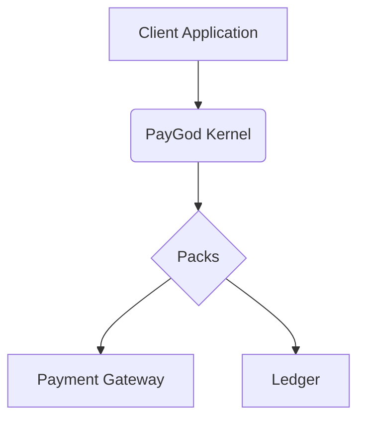

_This page describes the architecture of the PayGod Kernel._

## Core Components

The PayGod Kernel is composed of the following core components:

*   **Kernel**: The core of the system, responsible for managing packs and processing transactions.
*   **Packs**: Extensible modules that provide specific functionalities, such as payment methods or workflows.
*   **Contracts**: Data contracts that define the structure of the data exchanged between the kernel and the packs.

## High-Level Architecture

The following diagram illustrates the high-level architecture of the PayGod Kernel:

